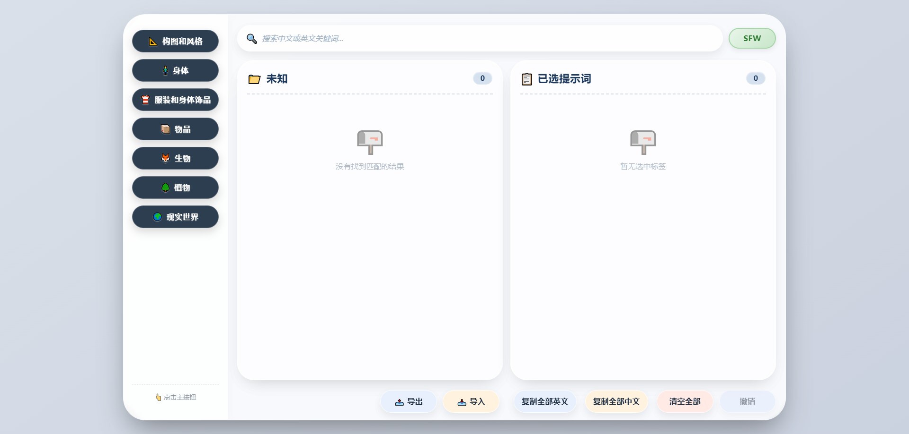

# Prompt 提示词管理工具

> **本仓库代码由 AI 生成，提示词源自 Danbooru，由 AI 进行翻译**

一个专为 AI 绘画（Stable Diffusion、ComfyUI 等）设计的专业提示词管理工具，帮助您高效地组织、管理和使用提示词。

## 📋 目录

- [项目介绍](#项目介绍)
- [技术栈](#技术栈)
- [主要功能](#主要功能)
- [快速开始](#快速开始)
- [项目结构](#项目结构)
- [数据配置](#数据配置)
- [功能详解](#功能详解)
- [配置说明](#配置说明)

## 项目介绍

在 AI 绘画创作中，提示词的质量直接影响生成效果。本工具提供了直观的图形界面，帮助您：

- **组织管理**：将提示词按分类体系进行组织，便于查找和使用
- **双语显示**：中英文对照显示，方便理解和使用
- **灵活调整**：支持拖拽排序、权重调整等高级功能
- **隐私保护**：支持 NSFW 内容过滤，一键切换显示模式

## 技术栈

| 技术       | 名称         | 版本    |
| :--------- | :----------- | :------ |
| Vue 3      | 前端框架     | ^3.5.25 |
| TypeScript | 静态类型系统 | ~5.9.3  |
| Pinia      | 状态管理     | ^3.0.4  |
| Vue Router | 路由管理     | ^4.6.4  |
| Vite       | 构建工具     | ^7.3.1  |
| SCSS       | 样式预处理   | ^1.97.3 |

## 主要功能

### 1. 提示词分类管理

- **一级分类**：构图和风格、身体、服装和身体饰品、性、物品、生物、植物、现实世界等
- **二级分类**：每个一级分类下包含多个细分二级分类
- **动态统计**：自动统计每个分类下的提示词数量
- **按需加载**：采用动态导入，优化性能

### 2. 双语显示

- **双语标签**：所有提示词以中文在上、英文在下方式显示
- **增强工具提示**：鼠标悬停显示完整英文提示词和来源信息
- **清晰排版**：卡片式设计，视觉效果出色

### 3. 已选提示词管理

- **拖拽排序**：支持通过拖拽调整已选提示词的顺序
- **权重调整**：点击标签后显示权重控制按钮，可调整提示词权重（范围 0.1-5.0，步长 0.1）
- **删除功能**：单个删除或一键清空所有已选提示词
- **撤销功能**：清空后可撤销恢复

### 4. 搜索功能

- **关键词搜索**：支持中英文关键词实时搜索
- **防抖优化**：300ms 延迟，避免频繁搜索
- **结果分组**：搜索结果按分类分组显示
- **智能过滤**：根据 NSFW 状态自动过滤结果

### 5. NSFW 内容过滤

- **一键切换**：SFW/NSFW 按钮切换，绿色/红色视觉反馈
- **三级控制**：支持一级分类、二级分类、提示词三级 NSFW 控制
- **状态持久化**：NSFW 状态缓存 1 小时
- **自动隐藏**：关闭 NSFW 时自动隐藏所有 NSFW 分类和内容

### 6. 导入导出功能

- **JSON 格式导出**：支持导出为 JSON 格式
- **JSON 格式导入**：支持从 JSON 文件或文本导入
- **合并/替换模式**：可选择合并到现有列表或替换
- **权重保留**：可选择是否保留权重信息

### 7. 复制功能

- **复制全部英文**：一键复制所有已选提示词的英文（含权重）
- **复制全部中文**：一键复制所有已选提示词的中文
- **复制反馈**：复制成功/失败提示

## 快速开始

### 环境要求

- Node.js 16.x 或更高版本
- npm 8.x 或更高版本

### 安装步骤

```bash
# 1. 克隆项目
git clone https://github.com/your-repo/prompt-website.git

# 2. 进入项目目录
cd prompt-website

# 3. 安装依赖
npm install

# 4. 启动开发服务器
npm run dev

# 5. 构建生产版本
npm run build

# 6. 预览生产版本
npm run preview
```

开发服务器启动后，访问 `http://localhost:5173` 即可。

### Docker 运行

```bash
# 1. 克隆项目
git clone https://github.com/your-repo/prompt-website.git

# 2. 进入项目目录
cd prompt-website

# 3. 构建镜像
docker build -t prompt-website .

# 4. 运行容器
docker run -d -p 8080:80 --restart=unless-stopped --name prompt-website prompt-website

# 5. 查看容器日志
docker logs -f prompt-website

# 6. 停止容器
docker stop prompt-website

# 7. 删除容器
docker rm prompt-website
```

容器启动后，访问 `http://服务器地址:8080` 即可。

## 项目结构

```text
prompt-website/
├── index.html                 # 入口 HTML 文件
├── package.json              # 项目配置文件
├── vite.config.ts            # Vite 构建配置
├── tsconfig.json             # TypeScript 配置
├── README.md                 # 项目说明文档
│
├── src/
│   ├── main.ts               # 应用入口文件
│   ├── App.vue               # 根组件
│   ├── style.css             # 全局样式
│   │
│   ├── assets/               # 静态资源（图片、字体等）
│   │
│   ├── components/           # Vue 组件
│   │   ├── ActionBar.vue     # 底部操作栏
│   │   ├── BilingualTag.vue  # 双语标签组件
│   │   ├── ImportExport.vue  # 导入导出组件
│   │   ├── LeftPanel.vue     # 左侧主分类面板
│   │   ├── NSFWToggle.vue    # NSFW 开关
│   │   ├── RightPanel.vue    # 右侧主面板
│   │   ├── SearchBar.vue     # 搜索框组件
│   │   ├── SelectedSection.vue # 已选提示词区域
│   │   ├── SubButtonSection.vue # 二级按钮区域
│   │   │
│   │   └── styles/           # 组件样式（SCSS）
│   │       ├── index.scss    # 样式入口文件
│   │       ├── ActionBar.scss
│   │       ├── BilingualTag.scss
│   │       ├── LeftPanel.scss
│   │       ├── RightPanel.scss
│   │       ├── SearchBar.scss
│   │       ├── SelectedSection.scss
│   │       ├── SubButtonSection.scss
│   │       ├── NSFWToggle.scss
│   │       ├── ImportExport.scss
│   │       ├── empty-state.scss
│   │       ├── global-tooltip.scss
│   │       └── enhanced-tooltip.scss
│   │
│   ├── data/                 # 数据文件
│   │   ├── categoryConfig.ts # 分类配置文件
│   │   ├── loader.ts         # 数据动态加载器
│   │   │
│   │   ├── plants/           # 植物分类数据
│   │   │   ├── flowers.ts    # 花卉提示词
│   │   │   ├── plant.ts      # 植物提示词
│   │   │   └── tree.ts       # 树木提示词
│   │   │
│   │   └── realword/         # 现实世界分类数据
│   │   │   ├── companies.ts  # 公司品牌提示词
│   │   │   ├── holidays.ts   # 节日提示词
│   │   │   ├── jobs.ts       # 职业提示词
│   │   │   └── locations.ts  # 地点提示词
│   │   │
│   │   └── xxxxx/            # 其它提示词
│   │
│   ├── stores/               # Pinia 状态管理
│   │   └── promptStore.ts    # 提示词状态管理
│   │
│   ├── types/                # TypeScript 类型定义
│   │   └── index.ts          # 全局类型定义
│   │
│   └── utils/                # 工具函数
│       └── debounce.ts       # 防抖函数
│
├── tsconfig.app.json         # 应用 TS 配置
├── tsconfig.node.json        # Node TS 配置
└── vite.config.ts            # Vite 配置
```

## 数据配置

### 1. 添加一级分类

在 `src/data/categoryConfig.ts` 文件中配置：

```typescript
// 一级按钮配置
export const mainCategoryConfigs: MainCategoryConfig[] = [
  {
    id: "your-category-id", // 唯一标识
    label: "你的分类名称", // 显示名称
    icon: "✨", // 图标（Emoji）
    nsfw: false, // 是否为 NSFW 分类
    subCategories: [], // 二级分类（见下文）
  },
  // ... 其他分类
];
```

### 2. 添加二级分类

在一级按钮的 `subCategories` 数组中添加：

```typescript
subCategories: [
  {
    key: "your-sub-key", // 唯一标识
    label: "子分类名称", // 显示名称
    icon: "🔍", // 图标（Emoji）
    fileName: "your-file-name", // 对应的数据文件名（无需 .ts 后缀）
    nsfw: false, // 是否为 NSFW 子分类
  },
];
```

### 3. 添加提示词数据

在对应的一级分类目录下创建数据文件（如 `src/data/your-category/your-file-name.ts`）：

```typescript
// src/data/your-category/your-file-name.ts
import type { PromptItem } from "../../types";

export const items: PromptItem[] = [
  // 普通提示词
  {
    chinese: "中文提示词",
    english: "english prompt",
  },

  // NSFW 提示词（可选）
  {
    chinese: "敏感内容",
    english: "nsfw content",
    nsfw: true,
  },
];
```

> 注意：数据文件会被 `loader.ts` 动态加载，无需其他配置。文件名必须与 `fileName` 字段一致。

## 功能详解

### 1. 拖拽排序

在"已选提示词"区域，可以直接拖拽标签来调整顺序：

- 按住标签并拖动
- 拖到目标位置释放
- 标签顺序自动更新
- 复制时的顺序与拖拽顺序一致

### 2. 权重调整

- 点击已选提示词标签激活权重控件
- 点击 `+` 增加权重（+0.1）
- 点击 `-` 减少权重（-0.1）
- 权重范围：0.1-5.0
- 权重不为 1.0 时，复制英文会显示为 `(prompt:weight)` 格式

### 3. 搜索功能

- 支持中英文关键词搜索
- 300ms 防抖延迟，优化性能
- 搜索结果按分类分组显示
- 搜索模式下可一键返回分类浏览
- NSFW 关闭时自动过滤敏感内容

### 4. 导入导出

**导出格式：**

```json
[
  {
    "chinese": "美丽",
    "english": "beautiful",
    "nsfw": false,
    "weight": 1.0
  }
]
```

**导入选项：**

- 合并模式：去重后添加到现有列表
- 替换模式：完全替换现有列表
- 可选择是否保留权重信息

### 5. 数据持久化

| 存储内容   | 存储位置     | 过期时间 |
| :--------- | :----------- | :------- |
| 已选提示词 | localStorage | 1 小时   |
| NSFW 状态  | localStorage | 1 小时   |
| 当前分类   | localStorage | 1 小时   |
| 子分类状态 | localStorage | 1 小时   |

## 配置说明

### 1. NSFW 缓存时间

在 `src/stores/promptStore.ts` 中修改：

```typescript
// 缓存过期时间：默认1小时（毫秒）
const CACHE_EXPIRY = 60 * 60 * 1000; // 修改为需要的毫秒数
```

### 2. 搜索防抖延迟

在 `src/components/RightPanel.vue` 中修改：

```typescript
// 300ms 延迟，可根据需要调整
const debouncedSearch = debounce(async (query: string) => {
  // ...
}, 300);
```

### 3. 权重范围配置

在 `src/stores/promptStore.ts` 的 `adjustWeight` 方法中修改：

```typescript
// 权重范围限制
newWeight = Math.max(0.1, Math.min(5.0, newWeight));
```

## 演示图

体验地址：https://prompt.refrain.com.cn


